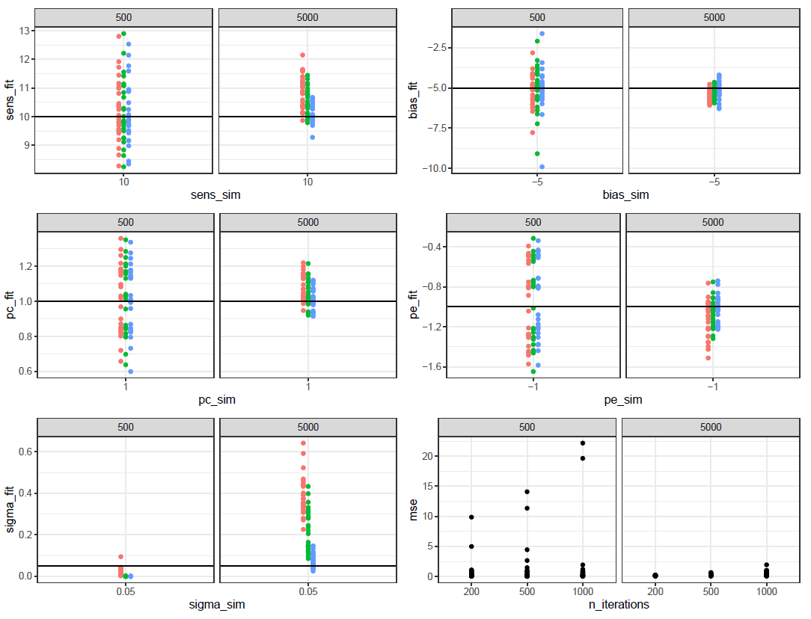

# slow_drift_correction
Fitting the model from Gupta &amp; Brody to human behavioral data. Based on https://codeocean.com/capsule/0617593/tree/v1.

By Anne Urai, 2022

---

#### Create a clean conda env
```
conda create -n ssm_env
conda activate ssm_env
conda install cython
conda install seaborn
git clone https://github.com/lindermanlab/ssm.git
cd ssm
pip install -e .
```


### Open questions
- what is the minimum number of trials needed to retrieve slow drift + history weights?
    - How does this depend on the size of the noise sigma?
- is there a numerical determinant of ELBO convergence? -> no, have to inspect visually
- how many `num_iter` do we need?
- how do `predEmissions` compare to binary choices?
- nice to have: printing function (with explanation of parameters)?
- does it matter that some trials are deleted due to timed-out responses?
- what if simulated drift has a AR coef lower than .9995, can the model still account for this given that a random walk being imposed?

### Questions for Diksha
- why is `A = 1`, rather than estimated (while fitting `C`)? Because now a random walk is imposed
- how is the analytical computation of sigma done? why analytical 
(estimated sigma seems to increase with higher number of trials -  insert image)? 
- how to interpret `C` (sometimes negative) and `sigma`? 
- why is `estDrift` computed by multiplying `Cs`? Sort of scaling to compensate for A = 1?
- would analysis work with only 500 trial per participant? or would a switching LDS where the drifting criterion jumps between observers be better?
- why all these functions with `noInput` and not use the default function of the package?
- why is drift mean centered in data simulation?

### Plan van aanpak
1. [x] answer: with our trial counts, can we even expect to get good fits?
     - [x] try simulations with data-ish parameters
2. [x] add confidence-scaling (use previous R simulations and fit with ntrials = 500)
3. [x] fit to real data from Beehives or Squircles task
    - [ ] correlate single-subject beta's with GLM weights
4. [ ] compare confidence-betas with R output, and with and without fixing sigma at 0

### Next ideas
- concatenate all trials across participants, then fit with a switching LDS where the drifting criterion jumps between observers
- what if the frequency of the slow drift wave changes over time? eg faster oscillations over time, problem because we only fit one AR coef?
- how does the fitting behave if sigma is not estimated analytically?

### To do
- design matrix predictors
- plotting psychometric functions


### Summary

#### Model

Following simple linear dynamical system (LDS) is used to disentangle slow drifts from systematic updating:

X_t = AX_t-1 + VU_t + b + w_t with w_t ~ N(0,sigma_d)

Y_t = CX_t + FU_t + d

- `X_t` is a latent process (i.e. the slow drift) and follows an AR(1) process.
- `U_t` is a matrix and contains observed variables that can influence the latent process
- `b` is a bias, or intercept
- `Y_t` represents the (observed) emissions
- `U_t` is a matrix and contains observed variables that can influence the emissions
    - stimulus strenght, previous confidence, previous response...
- `d` is a bias, or intercept

A is fixed to 1, imposing a random walk. V and b are fixed to 0, and sigma is estimated analytically.
The other parameters are estimated using the Expectation-Maximization algorithm (EM).

With these parameters the model can be rewritten as:
Y_t = d + FU_t + C(X_t-1 + w_t) with w_t ~ N(0,sigma_d)

Y_t is then transformed by a logistic function (1/1+exp(-Y_t)) and represents the probability of a 'right' response in a Bernoulli model.

#### Simulations: ntrials and niters

Simulations showed good parameter recovery, even for datasets with low number of trials (n=500).
Results were relatively stable over different values of iterations. 
However, for sigma we see that (1) it increases with the number of trials, (2) it decreases with the number of iterations?



 

#### Simulations: systematic updating
(gonna improve these simulations and plots later)

If we simulate data with slow drifts and systematic updating of previous response, confidence, sign evidence and absolute evidence we see a nice recovery when the model fits both slow drifts and systematic updating.
Especially given the fact that this is only with 500 trials (still going to check how this is for more trials)


#### Simulations: apparent systematic updating

If we simulate data with only slow drifts, and the model is only allowed to estimate systematic updating, then we see these apparent updating strategies. This replicates the earlier simulations in R.


#### Fitting to real data
If we fit the model to real data (beehives task) we see that the model converged nicely. 


This is the estimated slow drift (sudden jumps probably due to switches over participants?)


These are the estimates for the systematic updating.
In this order: sensitivity, prev resp, prev conf, prevresp*prevconf, prev sign evidence, prev abs evidence, prevsign*prevabsevi

